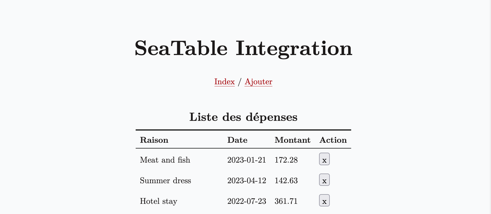

# SeaTable Expense Tracker

This project is a Rails application designed for tracking and managing data using SeaTable as the data storage solution. Key features of the application include:

- Displaying a list of expenses with reason, date, and amount.
- Adding a new expense with fields for name, date, and amount.
- Autocomplete functionality for expense names during entry.
- Deleting expenses directly from the list view via a delete icon.

## Preview

## Features

- **Expense Index**: Displays a list of saved expenses retrieved from SeaTable.
- **Add Expense**: Provides a form to add new expenses, including fields for reason, date, and amount, with autocomplete enabled for streamlined input.
- **Delete Expense**: Allows deletion of an expense directly from the list with a confirmation prompt using a "❌" icon.
